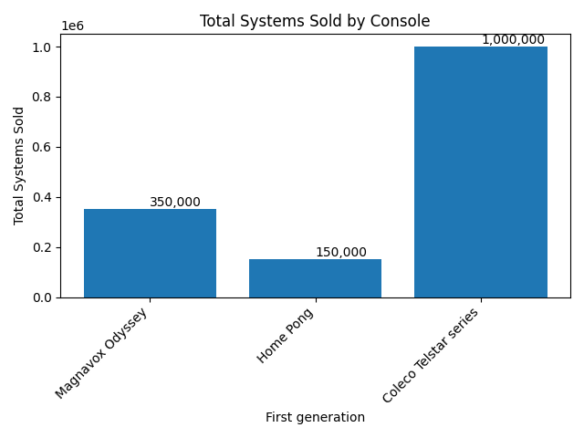
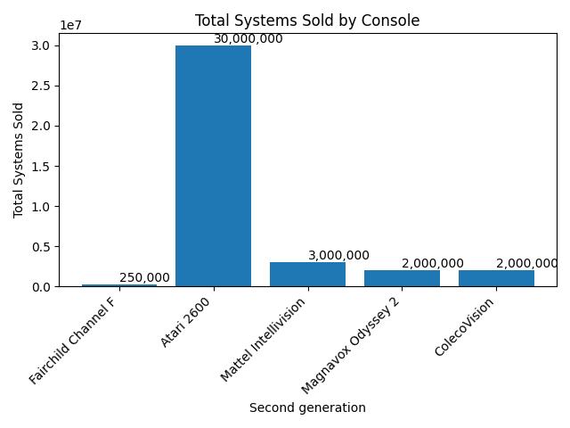
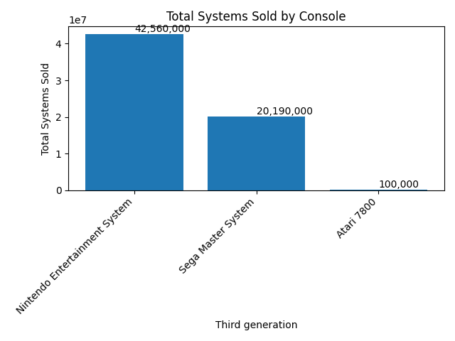
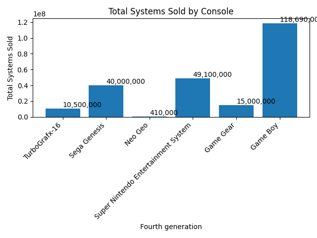
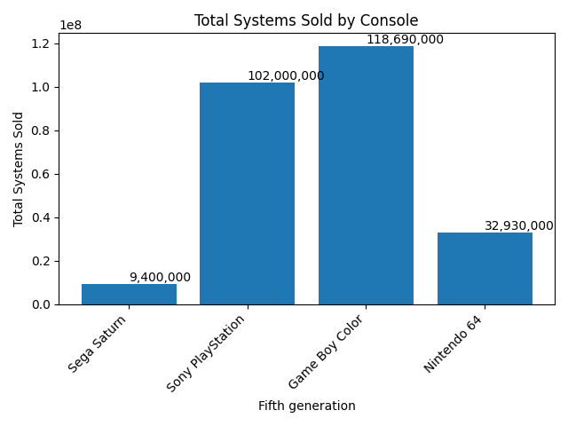
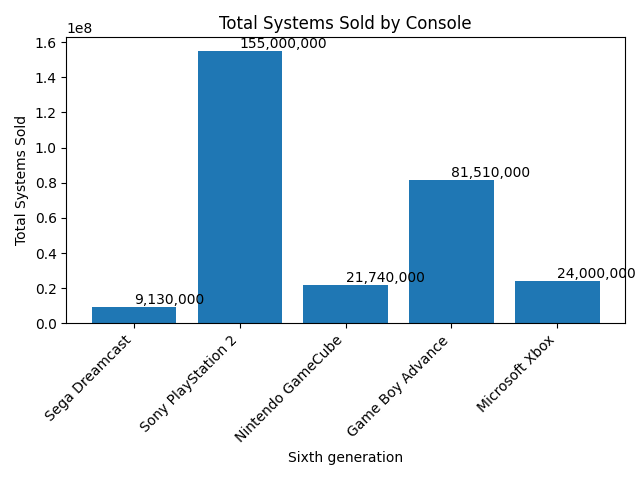
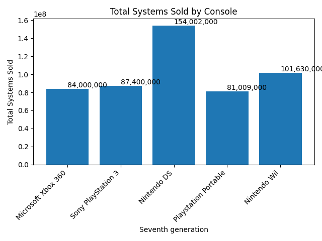
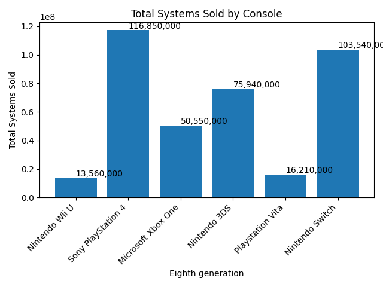
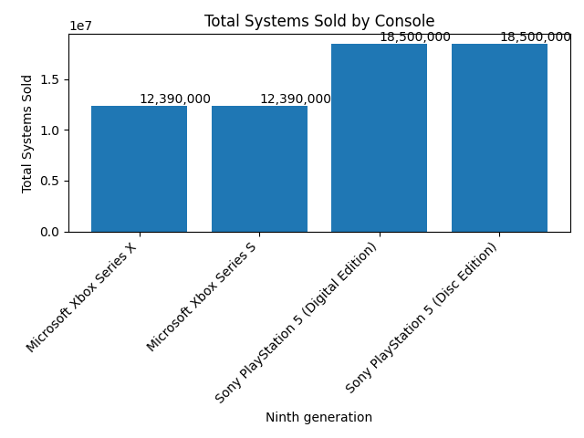

# PEP_ConsolasVendidasEnGeneracion
Es un proyecto para la acreditacion del curos de Platzi de "Curso de Python: Comprehensions, Funciones y Manejo de Errores", con el csv mostrare los datos de las
consolas mas vendidas en cada generacion
GENERACIONES:
- First
- Second
- Third
- Fourth
- Sixth
- Seventh
- Eighth
- Ninth

|
|
|
|
